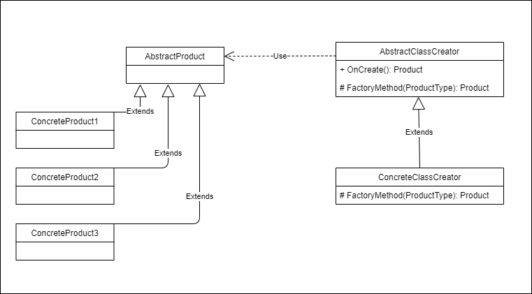

## Example 1

```csharp
var creator = new TextLogReaderCreator();

var reader = creator.Create(LogReaderType.SimpleText, simpleText);
reader.Read(2).Log();
```

#### OUTPUT
```
Ut enim ad minim veniam, quis nostrud exercitation ullamco laboris nisi ut aliquip ex ea commodo consequat. 
Duis aute irure dolor in reprehenderit in voluptate velit esse cillum dolore eu fugiat nulla pariatur.
Excepteur sint occaecat cupidatat non proident, sunt in culpa qui officia deserunt mollit anim id est laborum.
```

## Example 2

```csharp
var creator = new TextLogReaderCreator();

reader = creator.Create(LogReaderType.File, filePath);
reader.Read(23).Log();
```

#### OUTPUT
```
reader = creator.Create(LogReaderType.Event, machineName);
reader.Read(0).Log();
```

## Example 3

```csharp
var creator = new TextLogReaderCreator();

reader = creator.Create(LogReaderType.Event, machineName);
reader.Read(0).Log();

```

#### OUTPUT
```
Service stopped.
Category: Microsoft.AspNetCore.Server.Kestrel
Category: Microsoft.Extensions.Hosting.Internal.Host
Application: Magazine.AppHost.exe
CoreCLR Version: 8.0.624.26715
.NET Version: 8.0.6
```

#### SCHEMA

