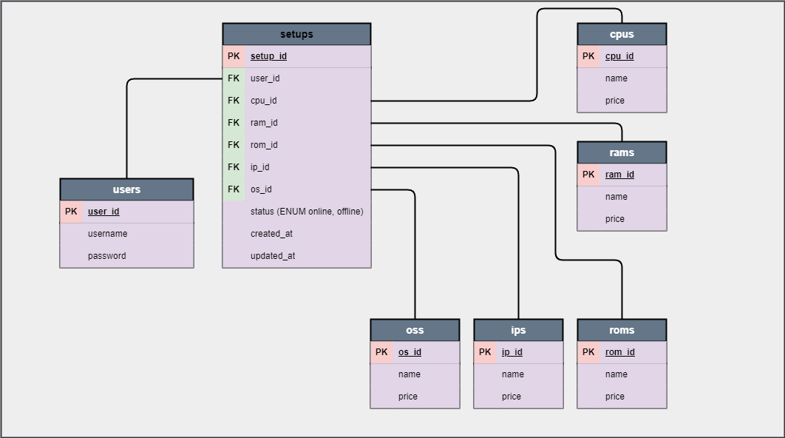
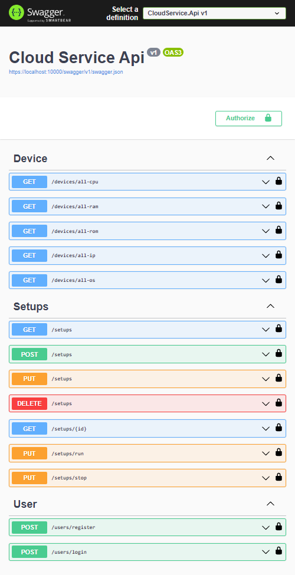

### ERD

### SWAGGER

### Users (simple auth)
<video controls>
  <source src="assets/video/users.mp4" type="video/mp4">
</video>

### Devices (only query)
<video controls>
  <source src="assets/video/devices.mp4" type="video/mp4">
</video>

### Setups (crud)
<video controls>
  <source src="assets/video/setups.mp4" type="video/mp4">
</video>