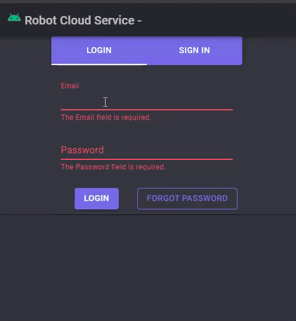

#### Robot cloud service
- Authentication Api (Asp.NetCore 8.0 web-api minimal)
- Remote Api (Asp.NetCore 8.0 web-api minimal)
- Client Web (Asp.NetCore 8.0 Blazor Server)
  
##### used:
- orm: Entity Framework
- db: Postgres
- cache: Redis
- queue: RabbitMq (MassTransit)
- ui: MudBlazor

##### simulation work
- background service on Remote Api

##### result

##### auth tests

##### remote tests
